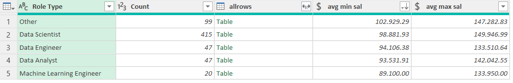
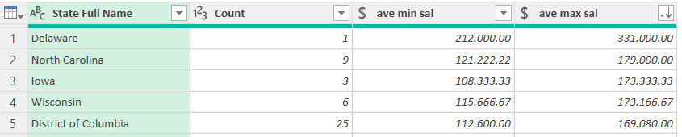
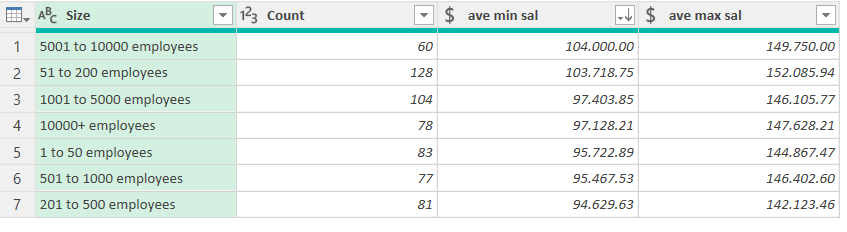

# Data Cleaning & Exploratory Data Analysis in Power Query

This project showcases my ability to clean and transform raw data using Power Query. An Exploratory Data Analysis (EDA) was also carried oud to help understand the data, identify patterns and ensure that the data is clean and ready for use. 

---

## Objective
- The primary objective of this project is to clean and transform the dataset to ensure it is ready for analysis.
- To validate the effectiveness of the cleaning process, exploratory analysis was performed to demonstrate that the transformed data could successfully answer questions such as:
1. **Which job titles or roles offer the highest salaries?**
2. **Which states provide the best compensation for data professionals?**
3. **What company sizes tend to pay the most?**

---

## DataSet

The dataset used in this project contains job postings for Data Science–related roles. It was sourced from Kaggle and imported into Power Query from a locally stored CSV file.
- Size: 611 rows, 21 columns
- Features include:
  - Job Title
  - Salary Estimate
  - Job Description
  - Company Name
---

## Project Workflow
1. Data Collection
2. Data Cleaning & Transformation
3. Exploratory Data Analysis
4. Insights and conclusions
   
---
## Key Insights
 - **Which job titles or roles offer the highest earning potential?** 
   
   Data Scientist roles have the highest potential salary with an average maximum of $149,946.99. The profession also has the highest volume of job listings (415 in total), the high salary across a large number of jobs is the industrry standard of what Data Scientists can expect to earn.

   Roles categorised as "Other" came in second for highest earning potential and have the highest average minimum salary. These are niche roles with rare skillsets do not fall under the typical "Analyst" or "Engineer" labels, as a result even at entry level companies are willing to pay more.

   There is a notable gap between Data Analyssy and Data Engineer, even though they have the same number of roles(47). Data Analysts have a higher earning ceiling ($142,042.55 max) and Data Engineers are slightly lower at $133,510.64 max. However, their minimums are very close (around $93k–$94k), meaning the starting point is similar, but Analysts have more room to grow.

   While often considered a high-paying field, in this dataset, Machine Learning Engineers show the lowest average max salary ($133,950) and the lowest minimum ($89,100). This might be due to the small sample size (only 20 roles)

    
   
- **Which states provide the best compensation for data professionals?**
  
   While Delaware shows the highest single salary in the dataset, North Carolina appears to be the most consistent high-paying state for data professionals, offering an average salary of $179k across multiple roles.

  Delaware's highest average salary was based on only one record. North Carolina, with 9 records provided a more reliable sample size.

   
  
- **What company sizes tend to pay the most?**
  
   Mid-sized companies with 51 to 200  employees offer the highest salaries. This shows that one does not necessarily need to work for big established coorporations to be paid well. 

  
  
---

## Conclusion 
   This project successfully demonstrated my ability to clean, transform, and prepare real world job posting data using Power Query. Through a series of steps that included standardizing text fields, parsing salary ranges, correcting location data, merging lookup tables, and performing grouped aggregations, the dataset was transformed and fully ready for analysis.

---

## Project Structure

**Data-Cleaning-In-Power-Query/**

├── 📁 [**Data Cleaning**](Data%20Cleaning/) 

│└── 📝 [**DataCleaning.md**](Data%20Cleaning/DataCleaning.md) — Detailed cleaning steps, transformations, and EDA.

├── 📁 [**datasets**](datasets/) — Raw and processed datasets used in this project. 

│    ├── 📄 [**Uncleaned_DS_jobs.csv**](datasets/Uncleaned_DS_jobs.csv) — Original Kaggle dataset. 

│    ├── 📄 [**State_mapping.xlsx**](datasets/State_mapping.xlsx) — Reference table for state names. 

│    └── 📊 [**CleanedData.xlsx**](datasets/CleanedData.xlsx) — Final cleaned and transformed output.

├── 📁 [**docs**](docs/)— Screenshots of Power Query techniques and transformations.

└── 📄 README.md — Project overview and documentation.

