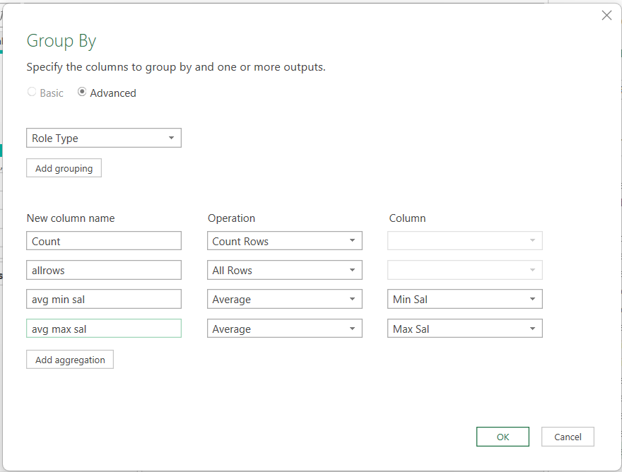
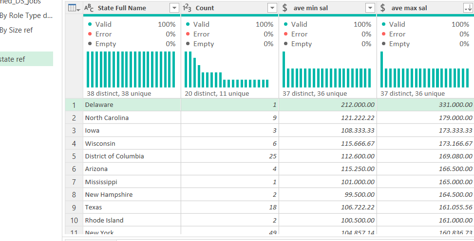
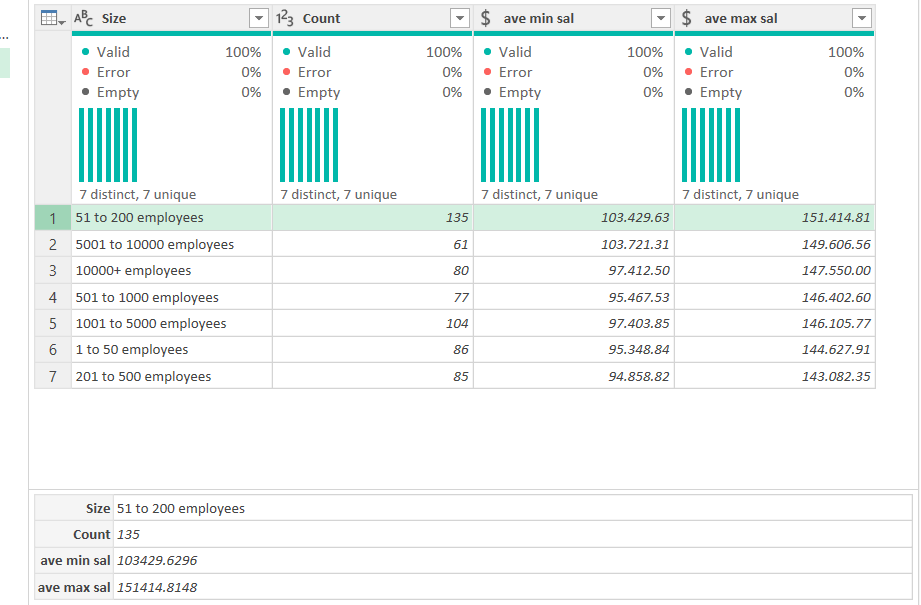
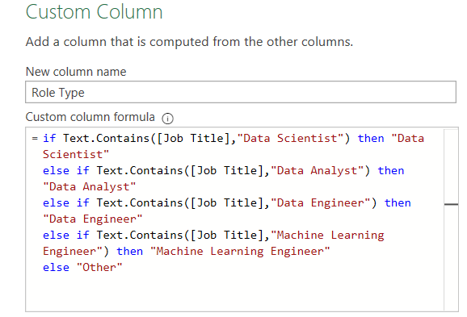
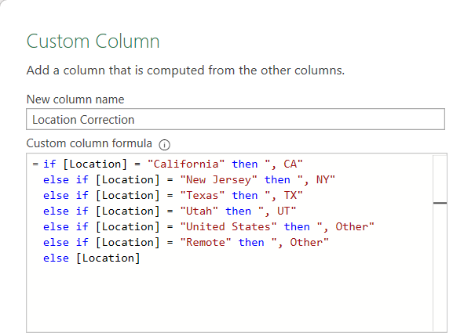
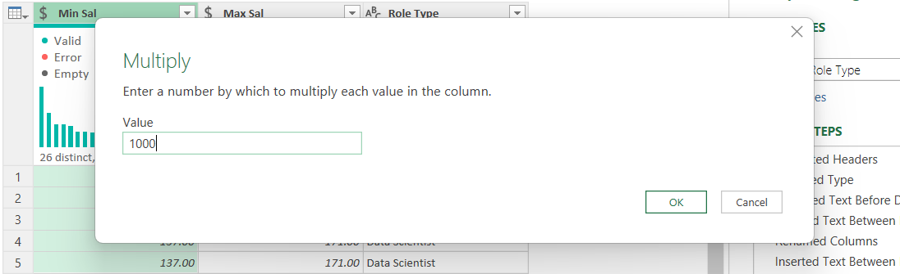
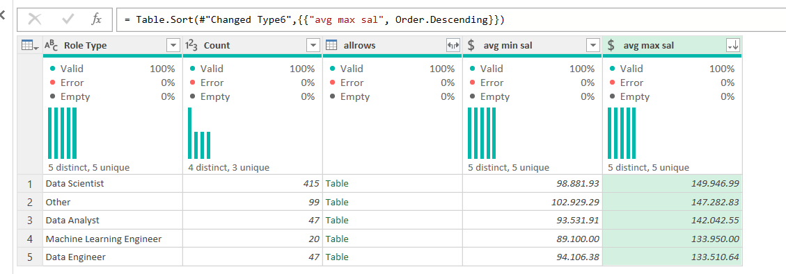
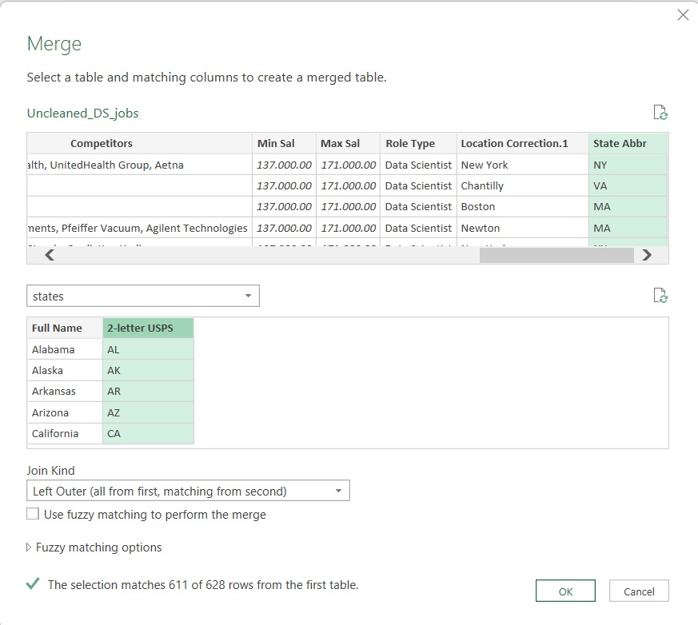

# Data Cleaning & Exploratory Data Analysis in Power Query

This project showcases my ability to clean and transform raw data using Power Query. I thereafter carried out an Exploratory Data Analysis (EDA) to help understand the data, identify patterns and ensure that the data is clean and ready for use. 

---

## Objective
- The primary objective of this project is to clean and transform the dataset to ensure it is ready for analysis.
- To validate the effectiveness of the cleaning process, exploratory analysis was performed to demonstrate that the transformed data could successfully answer questions such as:
- **Which job titles or roles offer the highest salaries?**
- **Which states provide the best compensation for data professionals?**
- **What company sizes tend to pay the most?**

---

## DataSet

The dataset used in this project contains job postings for Data Science–related roles. It was sourced from Kaggle and imported into Power Query from a locally stored CSV file.

---

## Project Workflow
1. Data Collection
2. Data Cleaning & Transformation
3. Exploratory Data Analysis
4. Insights and conclusions
   
---
## Key Insights
 - **Which job titles or roles offer the highest salaries?**
   ✅  The results showed that Data Scientist roles had the highest average salary.

   
   
- **Which states provide the best compensation for data professionals?**
✅ Delaware showed the highest average salary, although this was based on only one record.

✅ North Carolina, with 9 records, had the next highest average salary and provided a more reliable sample size.

  
- **What company sizes tend to pay the most?**
   ✅ The results showed that Companies with 51 to 200 employees have the highest average salary
  
---

## Conclusion 
This project successfully demonstrated my ability to clean, transform, and prepare real world job posting data using Power Query. Through standardizing text fields, parsing salary ranges, correcting location data, merging lookup tables, and performing grouped aggregations, the dataset was transformed and fully ready for analysis.

---

## Project Structure

```
Data-Cleaning-In-Power-Query/
│
├── 📁 datasets/                        # Raw datasets used for the project 
│
│   ├── Uncleaned_DS_jobs.csv           # Raw data from Kaggle in csv format
│   ├── State_mapping.xlsx              # State mapping table with full names of states
│   ├── CleanedData.xlsx                # Excel file of relevant columns that are cleaned and transformed
│
├── 📁 docs/                           # Screenshots showing different techniques applied during cleaning cleaning and transformations                       
│
└── README.md                           # Project overview
```
---


## Data Cleaning and Transformation Steps
### 1. **Standardizing Job Titles**

Many job titles referred to the same role but were labeled differently (e.g., “Junior Data Analyst”). Used conditional logic (IF statements) to standardize these variations into consistent titles (e.g., any title containing “Data Scientist” was standardized to “Data Scientist”).



### 2. **Handling Company Size Values**

To analyze which company sizes offer the highest salaries, I filtered out rows in the Size column where the values were -1 or “unknown,” since these represented missing or invalid information. Only 44 rows were removed.

### 3. **Extracting Salary Ranges**

Extracted the minimum and maximum salary values from the **Salary Estimate** column, which originally contained a salary range along with the source label “Glassdoor est.” I extracted the numerical values by isolating all text to the left of the opening bracket. From the cleaned salary range, created two separate columns: **Min Sal** and **Max Sal**.

### 4. **Extracting State Abbreviations**

The Location column contained mixed formats, some values included a city and state, while others (e.g., “Remote,” “United States,” or single states) contained no comma. Splitting by comma initially created nulls.
To resolve this, I created artificial commas for locations that lacked one. I also grouped values such as “Remote” and “United States” into a single category labeled “Other.”

I created a custom column called **Location Correction** using an IF statement to assign a comma to each value. 
        



After correcting all values in this way, I split the **Location Correction** column by the comma delimiter to extract the state abbreviation.

### 5. **Calculating Salaries by Role**

To determine which roles paid the best, I duplicated the query and named it “Sal by Role Type dup.”
I kept only the relevant columns: **Min Sal**, **Max Sal**, and **Role Type**.

Changed Min and Max salary columns to Currency and multiplied values by 1,000 to reflect monetary values.



Used Group By on Role Type and calculated:
- Average Min Salary
- Average Max Salary
- Row Count
- All Rows (for exploration)
<!-- 
 
-->


✅  The results showed that Data Scientist roles had the highest average salary.



### 6. **Calculating Salaries by Company Size**
Repeated Step 5 and used columns: **Min Sal**, **Max Sal**, and **Size**.
Used Group By on Role Type and calculated:
- Average Min Salary
- Average Max Salary
- Row Count
  


 ✅ The results showed that Companies with 51 to 200 employees have the highest average salary

### 7. Calculating Salary by State

To analyze which states offered the highest salaries, I needed to match the state abbreviations in the dataset with their full state names. The challenge was that the dataset only contained state abbreviations in the State Abbr column, without the corresponding full names.

To fix this:

- I imported a State Mapping Table which containtained a list of state full names and their corresponding two letter abbreviations.

- Prepared the Data for Merging
   - Before merging, I ensured that the values in the State Abbr column were clean and consistent. This included applying Trim to remove unwanted spaces and ensure character length consistency.

- Merged the Queries
  - I performed a Left Join between the main dataset and the state mapping table, matching on the 2-letter state abbreviation. This allowed me to bring in the full state names for accurate grouping and reporting.




- Calculated Average Salaries by State
        - After merging, I grouped the data by State and calculated average Min and Max salary values.

**Results:**

✅ Delaware showed the highest average salary, although this was based on only one record.

✅ North Carolina, with 9 records, had the next highest average salary and provided a more reliable sample size.


## Conclusion 
This project successfully demonstrated my ability to clean, transform, and prepare real world job posting data using Power Query. Through standardizing text fields, parsing salary ranges, correcting location data, merging lookup tables, and performing grouped aggregations, the dataset was transformed and fully ready for analysis.

---

## Project Structure

```
Data-Cleaning-In-Power-Query/
│
├── 📁 datasets/                        # Raw datasets used for the project 
│
│   ├── Uncleaned_DS_jobs.csv           # Raw data from Kaggle in csv format
│   ├── State_mapping.xlsx              # State mapping table with full names of states
│   ├── CleanedData.xlsx                # Excel file of relevant columns that are cleaned and transformed
│
├── 📁 docs/                           # Screenshots showing different techniques applied during cleaning cleaning and transformations                       
│
└── README.md                           # Project overview
```
---
